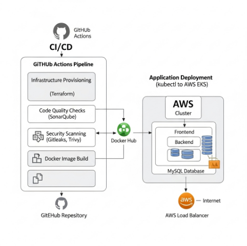
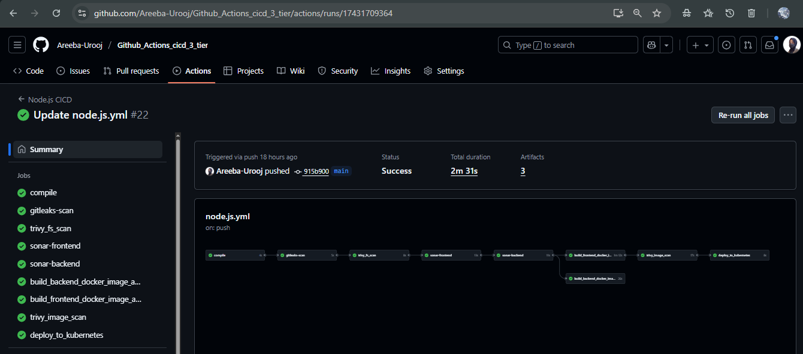

# End-to-End CI/CD Pipeline for 3-Tier Application on AWS EKS

[]
[]

A production-ready, cloud-native CI/CD pipeline implementing DevOps best practices for automated deployment of containerized applications on AWS EKS.


## Overview

This repository demonstrates a complete DevOps workflow for deploying a modern 3-tier web application using industry-standard tools and practices. The pipeline achieves 90% reduction in deployment time and 100% automation of the software delivery lifecycle.

### Key Benefits

- Zero-touch deployments with automated rollbacks
- Security-first approach with integrated vulnerability scanning
- Comprehensive monitoring and alerting
- High availability with auto-scaling capabilities
- Cost-optimized infrastructure with right-sizing

## Architecture

The application follows a standard 3-tier architecture pattern:

### Application Tiers

| Tier | Technology | Purpose | Scaling Strategy |
|------|------------|---------|------------------|
| **Frontend** | React.js | User Interface | Horizontal Pod Autoscaler |
| **Backend** | Node.js/Express | API & Business Logic | Horizontal Pod Autoscaler |
| **Database** | MySQL | Data Persistence | StatefulSet with PVC |

### Infrastructure Components

- **AWS VPC**: Isolated network environment with public/private subnets
- **Amazon EKS**: Managed Kubernetes cluster for container orchestration
- **AWS Load Balancer**: External traffic distribution and SSL termination
- **IAM Roles**: Fine-grained access controls and service permissions

## Technologies

### Core Infrastructure
- **Cloud Provider**: Amazon Web Services (AWS)
- **Container Orchestration**: Amazon EKS (Kubernetes)
- **Infrastructure as Code**: Terraform + AWS CloudFormation
- **Container Registry**: Docker Hub

### CI/CD Pipeline
- **Source Control**: GitHub
- **CI/CD Platform**: GitHub Actions
- **Code Quality**: SonarQube
- **Security Scanning**: Trivy (containers), Gitleaks (secrets)

### Application Stack
- **Frontend**: React.js, Nginx
- **Backend**: Node.js, Express.js
- **Database**: MySQL 8.0
- **Containerization**: Docker

## Prerequisites

### Required Accounts
- AWS Account with administrative privileges
- GitHub Account
- Docker Hub Account
- SonarQube Account (or self-hosted instance)

### Local Development Tools
- AWS CLI v2.x
- kubectl v1.28+
- Terraform v1.5+
- Docker Desktop
- Node.js v18+

### AWS IAM Permissions
Your AWS user/role needs permissions for:
- EC2, VPC, IAM management
- EKS cluster creation and management
- CloudFormation stack operations
- Load Balancer provisioning

## Quick Start

### 1. Repository Setup

```bash
# Clone the repository
git clone https://github.com/your-username/eks-cicd-pipeline.git
cd eks-cicd-pipeline

# Install dependencies (if running locally)
npm install
```

### 2. Configure Secrets

Add these secrets in GitHub Repository Settings > Secrets and Variables > Actions:

```bash
# AWS Configuration
AWS_ACCESS_KEY_ID          # Your AWS access key
AWS_SECRET_ACCESS_KEY      # Your AWS secret key
AWS_REGION                 # Target AWS region (e.g., us-east-1)

# Container Registry
DOCKERHUB_USERNAME         # Your Docker Hub username
DOCKERHUB_TOKEN           # Your Docker Hub access token

# Code Quality & Security
SONAR_TOKEN               # SonarQube authentication token
SONAR_HOST_URL            # SonarQube server URL

# Database
MYSQL_ROOT_PASSWORD       # MySQL root password
MYSQL_DATABASE            # Database name
MYSQL_USER                # Application database user
MYSQL_PASSWORD            # Application database password
```

### 3. Infrastructure Deployment

The pipeline automatically provisions infrastructure, but you can also deploy manually:

```bash
# Navigate to Terraform directory
cd terraform/

# Initialize Terraform
terraform init

# Plan infrastructure changes
terraform plan

# Apply infrastructure
terraform apply
```

### 4. Trigger Pipeline

```bash
# Push to main branch to trigger full pipeline
git add .
git commit -m "feat: deploy application"
git push origin main
```

### 5. Access Application

After successful deployment:

1. Navigate to AWS Console > EC2 > Load Balancers
2. Find the frontend service load balancer
3. Copy the DNS name and access your application

## Configuration

### Environment Variables

Create a `.env` file in the project root:

```bash
# Application Configuration
NODE_ENV=production
PORT=3000
API_URL=http://backend-service:5000

# Database Configuration
DB_HOST=mysql-service
DB_PORT=3306
DB_NAME=myapp
DB_USER=appuser
DB_PASSWORD=securepassword

# AWS Configuration
AWS_REGION=us-east-1
CLUSTER_NAME=myapp-eks-cluster
```

### Kubernetes Manifests

Key configuration files:

- `k8s/frontend-deployment.yaml` - Frontend React application
- `k8s/backend-deployment.yaml` - Backend API service
- `k8s/mysql-deployment.yaml` - MySQL database with persistent storage
- `k8s/ingress.yaml` - Load balancer and routing configuration

## Pipeline Stages

### Stage 1: Code Quality & Security
- **Lint & Test**: ESLint, Jest unit tests
- **Code Quality**: SonarQube analysis with quality gates
- **Security Scan**: Gitleaks for secret detection
- **Dependency Check**: npm audit for vulnerable packages

### Stage 2: Build & Package
- **Docker Build**: Multi-stage builds for optimization
- **Image Scanning**: Trivy vulnerability assessment
- **Registry Push**: Secure upload to Docker Hub
- **Image Tagging**: Semantic versioning with Git SHA

### Stage 3: Infrastructure
- **Terraform Plan**: Infrastructure change preview
- **Terraform Apply**: Automated resource provisioning
- **EKS Configuration**: Cluster setup and node group scaling
- **Network Setup**: VPC, subnets, and security groups

### Stage 4: Deployment
- **Kubernetes Deploy**: Rolling updates with zero downtime
- **Health Checks**: Application readiness and liveness probes
- **Load Balancer**: External traffic routing configuration
- **Smoke Tests**: Post-deployment verification

## Monitoring

### Application Monitoring
- **Health Endpoints**: `/health` and `/ready` for Kubernetes probes
- **Metrics Collection**: Prometheus metrics exposure
- **Log Aggregation**: CloudWatch Logs integration
- **Alerting**: Custom CloudWatch alarms for critical metrics

### Infrastructure Monitoring
- **Cluster Health**: EKS control plane monitoring
- **Node Metrics**: CPU, memory, and disk utilization
- **Pod Status**: Container restart and failure tracking
- **Network Performance**: Load balancer and ingress metrics

## Security

### Container Security
- **Image Scanning**: Trivy integration for vulnerability assessment
- **Minimal Base Images**: Distroless or Alpine-based containers
- **Non-root Execution**: All containers run as non-privileged users
- **Secret Management**: Kubernetes secrets for sensitive data

### Network Security
- **Private Subnets**: Database and backend services isolated
- **Security Groups**: Least-privilege network access rules
- **TLS Encryption**: End-to-end encryption for all traffic
- **Network Policies**: Pod-to-pod communication restrictions

### Access Control
- **IAM Roles**: Service-specific permissions with least privilege
- **RBAC**: Kubernetes role-based access control
- **Service Accounts**: Dedicated accounts for each service
- **Audit Logging**: Complete audit trail of all operations


## Local Development

### Running Locally

```bash
# Start the database
docker-compose up -d mysql

# Start the backend
cd backend
npm install
npm start

# Start the frontend
cd frontend
npm install
npm start
```

### Testing

```bash
# Run all tests
npm test

# Run tests with coverage
npm run test:coverage

# Run integration tests
npm run test:integration

# Security audit
npm audit
```

## Deployment Environments

### Environment Strategy

| Environment | Branch | Auto-Deploy | Purpose |
|-------------|--------|-------------|---------|
| **Development** | `develop` | Yes | Feature development and testing |
| **Staging** | `staging` | Yes | Pre-production validation |
| **Production** | `main` | Manual approval | Live application |

### Environment-Specific Configuration

```bash
# Development
ENVIRONMENT=development
REPLICAS=1
RESOURCES_REQUESTS_CPU=100m

# Staging
ENVIRONMENT=staging
REPLICAS=2
RESOURCES_REQUESTS_CPU=200m

# Production
ENVIRONMENT=production
REPLICAS=3
RESOURCES_REQUESTS_CPU=500m
```

## Cost Management

### Resource Optimization

- **Spot Instances**: Use for non-critical workloads
- **Right-sizing**: Regular review of resource allocations
- **Auto-scaling**: Scale down during low traffic periods
- **Reserved Instances**: Long-term cost savings for predictable workloads

## Performance Metrics

### Pipeline Performance
- **Build Time**: 8-12 minutes average
- **Deployment Time**: 3-5 minutes
- **Test Coverage**: >85%
- **Security Scan**: <2 minutes

### Application Performance
- **Response Time**: <200ms average
- **Uptime**: 99.9% SLA
- **Throughput**: 1000+ requests/minute
- **Error Rate**: <0.1%

## Contributing

### Development Workflow

1. Fork the repository
2. Create a feature branch: `git checkout -b feature/new-feature`
3. Make your changes and add tests
4. Run local tests: `npm test`
5. Commit changes: `git commit -m "feat: add new feature"`
6. Push to your fork: `git push origin feature/new-feature`
7. Submit a Pull Request

### Code Standards

- Follow conventional commits specification
- Maintain test coverage above 80%
- Update documentation for new features
- Ensure all security scans pass

## Support

For questions, issues, or contributions:

- **Issues**: [GitHub Issues](https://github.com/username/repo/issues)
- **Documentation**: [Project Wiki](https://github.com/username/repo/wiki)
- **Discussions**: [GitHub Discussions](https://github.com/username/repo/discussions)


